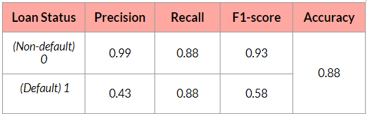

# FinancialAnalytics

## Introduction
The consistent year-on-year increase in HDB resale prices and rental fees, coupled with the growing preference for renting among Singaporeans aged between 22 to 29, highlights an emerging trend. Anticipating a surge in demand and recognizing the potential financial strain on individuals in this age group, we were inspired to develop a distinctive scorecard tailored specifically for their needs. This innovative scoring system aims to facilitate affordable loans for renting, ensuring that Singaporeans in the specified age range can manage the increasing costs effectively. Notably, the scorecard eliminates age as a factor when assessing an applicant's likelihood of default, promoting impartiality and preventing bias based on age.

## Analysis and Results
The following snippets highlight key findings. To delve deeper into the details, feel free to click here and access the full presentation.

The dataset that we will be using comes from kaggle:
[Kaggle Dataset](https://www.kaggle.com/datasets/laotse/credit-risk-dataset)

After Tuning our scorecard, we were able to achieve the following results:

* [Proposal](https://docs.google.com/presentation/d/1kWSjU8n_Rxd4yn-r9JhZkRu4cixcXZ9m-WwsnNc7h3c/edit?usp=drive_link)
* [Final Presentation](https://docs.google.com/presentation/d/1dj88yO0ZlO62Fw0uzqz3rClUMMzc6q6Q/edit?usp=drive_link&ouid=112530520241884552202&rtpof=true&sd=true)
